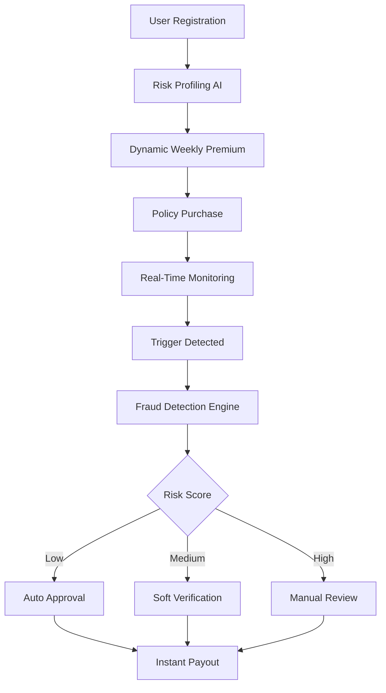

# 🚀 ParametriX-AI : AI-Powered Parametric Insurance for India’s Gig Workers  
**Guidewire DEVTrails 2026 – Phase 1 Submission**

---

## 📌 Problem Understanding

India’s gig economy—comprising millions of delivery partners for platforms like Zomato, Swiggy, Blinkit, and Amazon—is highly dependent on **daily earnings**. However, external disruptions can reduce their income by **20–30%**, with **zero financial protection**. These disruptions include:

- 🌧️ **Heavy rain / Floods**
- 🌡️ **Extreme heatwaves**
- 🌫️ **Severe air pollution (AQI)**
- 🚫 **Curfews / Strikes**
- 🚦 **Severe traffic blockages**

### ❌ The Current Gap
- **No Income Protection:** There's no insurance product that covers pure *loss of income*.
- **Inefficient Legacy Systems:** Existing claim systems are manual, slow, fraud-prone, and not designed for the rapid, day-to-day workflow of gig workers.

---

## 🎯 Our Solution

We propose an **AI-Powered Parametric Insurance Platform** built for the modern gig worker. It is designed to be a "zero-touch" safety net:

✅ **Proactive Detection:** Automatically detects weather and real-world disruptions.  
✅ **Zero-Touch Claims:** Triggers claims automatically without any manual requests.  
✅ **Dynamic Pricing:** Calculates fair, accessible weekly premiums using AI.  
✅ **Instant Payouts:** Directly credits workers for lost income via UPI.  
✅ **Robust Security:** Prevents fraud using a multi-layered AI-driven validation engine.  

---

## 👤 User Persona

### 👨‍🦱 Primary Persona: Rahul (Food Delivery Partner)

| Attribute | Details |
| :--- | :--- |
| **Age** | 24 |
| **Platform** | Zomato |
| **Work Hours** | 8–10 hrs/day |
| **Daily Earnings** | ₹800–₹1,200 |
| **Work Area** | Flood-prone urban zone |
| **Dependency** | Fully dependent on daily income; zero safety net. |

### 💡 Needs
- **1-Click Onboarding:** Simple UI for users with low tech literacy.
- **Affordability:** Weekly, bite-sized insurance premiums.
- **Instant Payout:** Automated process; no paperwork or delays.
- **Trust & Fairness:** Transparent rules with no false rejections.

---

## 🔄 System Workflow



---

## 💰 Premium Model (Weekly Pricing)

We implement a **Dynamic Risk-Based Pricing Model** to keep premiums compliant with micro-insurance guidelines (< ₹200/week) while adjusting for localized risks.

**Formula:**  
`Premium = Base Price + Risk Adjustments`

**Example Calculation:**
| Factor | Adjustment |
| :--- | :--- |
| **Base Premium** | ₹50 |
| **Flood Risk** | +₹10 |
| **Pollution Risk** | +₹5 |
| **Safe Zone Discount** | -₹5 |
| **👉 Final Premium** | **₹60/week** |

---

## ⚡ Parametric Triggers

Our system polls real-time third-party APIs against strict thresholds to trigger payouts.

### 🔹 Core Triggers:
| Trigger | Threshold Condition |
| :--- | :--- |
| **Rainfall** | > 50 mm/hr |
| **Heatwave** | > 45°C |
| **Air Quality (AQI)** | > 300 (Severe) |
| **Traffic Block** | Severe congestion (API verified) |
| **Curfew** | Verified Government restriction |

> 💡 **Key Principle:** We insure the **LOSS OF INCOME**, not the event itself.

---

## 🧠 AI Strategy

### 1️⃣ Risk Assessment Model
Determines the weekly premium for each rider based on individual and localized risk.

* **Inputs:** Location, Historical weather logic, Delivery activity, Zone risk level.
* **Outputs:** Risk score (0–1) and calculated Weekly Premium.

### 2️⃣ Fraud Detection Model (Binary Classification)
Analyses the legitimacy of a claim to prevent systemic abuse.

* **Inputs:** Behavioral Data + Environmental Data
* **Outputs:** Fraud Probability Score

---

## 🚨 Anti-Spoofing & Adversarial Defense

### ⚠️ Problem (The "Market Crash" Scenario)
Fraudsters attempting GPS spoofing, fake weather claims, or mass coordinated attacks (sybil attacks), draining system funds with false payouts.

### ✅ Our Solution: Multi-Layer Fraud Detection
We **DO NOT** rely on GPS alone. We use a composite of multi-signal validations:

| Signal | Purpose |
| :--- | :--- |
| 📍 **GPS** | Location validation |
| 📱 **Device Sensors** | Movement & telemetry detection |
| 🚴 **Delivery Activity** | Real work validation (API integration) |
| 📶 **Network Data** | Indoor vs. outdoor IP verification |
| 📊 **Historical Behavior** | Pattern & behavioral analysis |
| 🌦️ **Weather Correlation**| Ground-truth area validation |
| 👥 **Peer Matching** | Crowd verification (checking nearby riders) |

### 🧠 Fraud Detection Logic
* **Real worker in rain:** High movement + Weather match → **APPROVED**
* **Fraudster at home:** Static + WiFi + No activity → **FLAGGED**

### 🧮 Fraud Scoring System
| Score | Action |
| :--- | :--- |
| **0–20%** | Instant payout (Zero-touch) |
| **20–60%** | Soft verification requested |
| **60%+** | Manual review / Flagged |

#### 🧩 Advanced Fraud Detection Measures
- GPS drift anomaly detection
- Speed inconsistency checks (telemetry)
- Cluster fraud detection (group attacks)
- Device fingerprinting

### ⚖️ UX Balance Strategy
We ensure absolute fairness to honest users while maintaining strict security:
* **Flow:** Instant payout for safe users ➡️ Soft verification for uncertain cases ➡️ No harsh blocking without explicit reason.
* **Verification Methods (If flagged):** Selfie with timestamp, Delivery app screenshot, Activity logs.

---

## 🏗️ Technical Architecture

```text
[ Frontend (React.js) ]
          ↓
[ Backend (Express.js) ]
          ↓
[ Microservices ]
   ├── Risk Engine (AI)
   ├── Fraud Detection Engine
   ├── Claim Engine
   └── Payment Engine
          ↓
[ AI Layer (FastAPI + ML Models) ]
          ↓
[ Database (MongoDB) ]
          ↓
[ External APIs (Weather, Maps, Razorpay) ]
```

---

## 🧰 Tech Stack

* 🎨 **Frontend:** JavaScript, React.js
* ⚙️ **Backend:** Node.js, Express.js
* 🗄️ **Database:** MongoDB
* 🤖 **AI Layer:** Python (FastAPI), Scikit-learn / TensorFlow
* 🌐 **External APIs:** OpenWeatherMap, Google Maps, Razorpay / NPCI UPI

---

## 📊 Deliverables (Phase 1 Scope)

We will deliver the foundational elements required for the Hackathon:
- [x] 📄 Detailed Idea Document (This README)
- [x] 🧠 System design & workflow
- [x] 💰 Premium logic & Pricing Model
- [x] ⚡ Parametric trigger definitions
- [x] 🤖 AI & Fraud strategy outline
- [x] 🛡️ Anti-spoofing system design

---

## 🚀 Future Scope (Phase 2 & 3)
- Execute real-time trigger engine polling.
- Implement the fully automated claims system.
- Deploy advanced fraud ML models.
- Integrate instant payment (Razorpay/UPI sandbox).
- Build the Analytics dashboard for Admin and Riders.

---

## 🏁 Why Our Solution Stands Out

✅ **Fully Automated Parametric System:** No paper claims.  
✅ **AI-Driven Dynamic Pricing:** Fair, accessible micro-premiums.  
✅ **Strong Fraud Prevention:** Resilient to complex spoofing & "Market Crash" events.  
✅ **Real-World Scalability:** Cloud-native microservices architecture.  
✅ **User-Friendly Design:** Built explicitly for the tech literacy of average gig workers.  

### 👥 Our Team Vision
> We aim to build a trustworthy, scalable, and intelligent insurance system that protects millions of gig workers in India.

### 🧠 Final Thought
> *"Insurance should not be a claim. It should be an instant safety net."*
